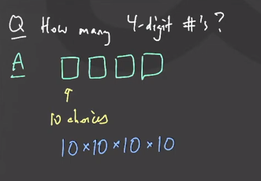
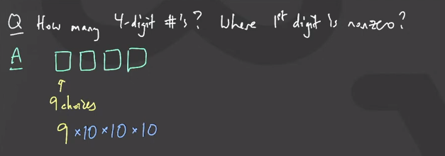
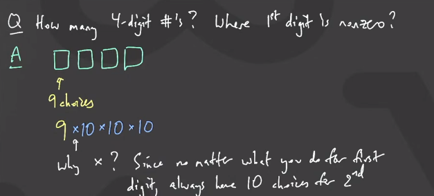
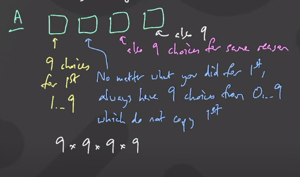
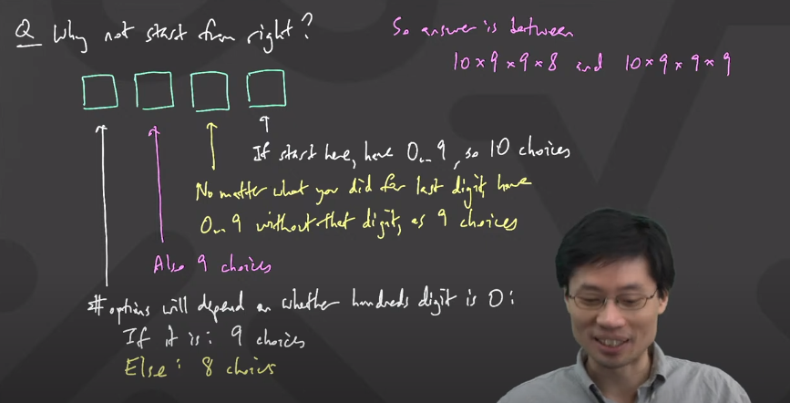
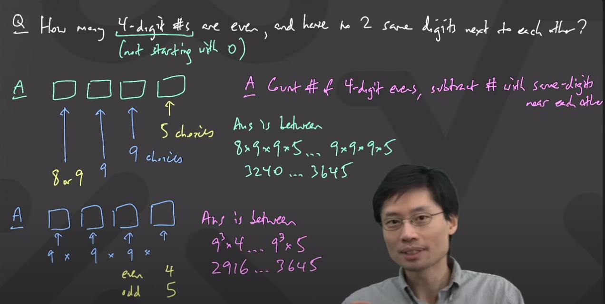
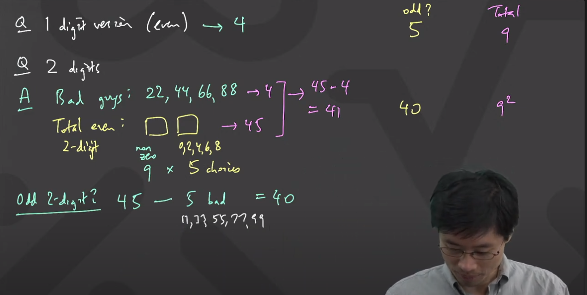
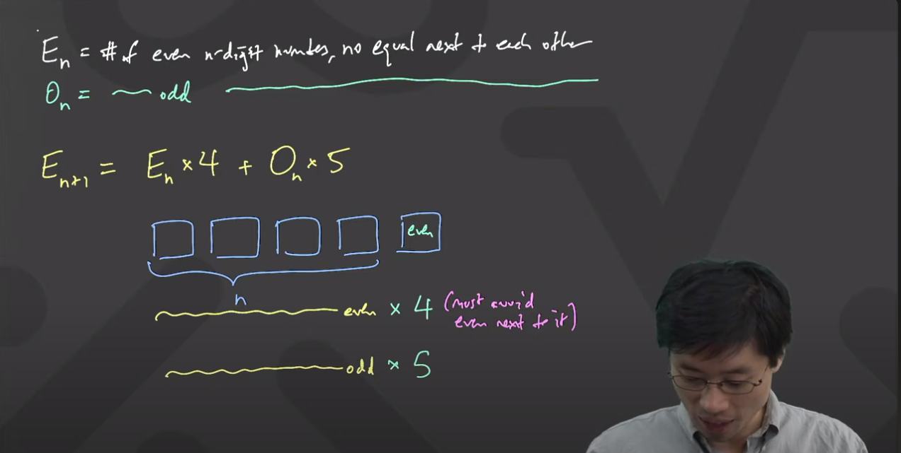
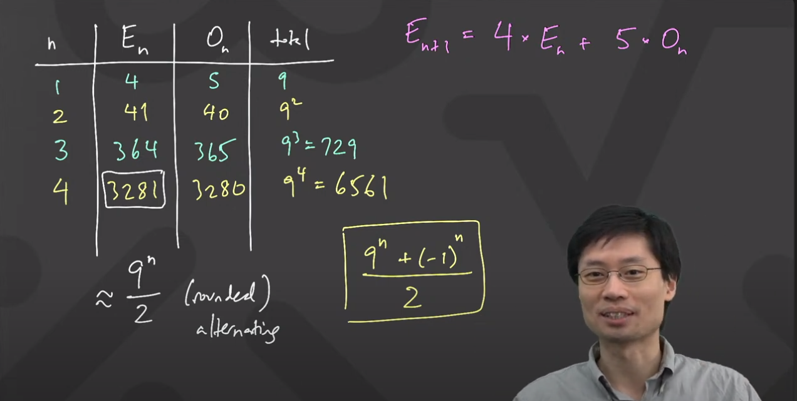

# CMU Discrete Mathematics 2/1
https://www.youtube.com/live/0K540qqyJJU?si=DV5c16lA3-Y2IqnD

# How many 4 digit numbers are there?

- each place can have 10 choices, from 0 to 9

# How many 4 digit nubmers are there? where the first digit is non-zero.

- ecah place can have 10 choices, except the first place.
- the first place can not have a zero, remaining 1...9= 9 choices.
  

# How many 4 digit numbers with 1st non-zero digit and no two same digits next to each other?

- The first place will have 9 choices, because of non-zero digit.
- The remaining will have 10 choices, but to avoid same digit next to each other, will only have 9 choices.

### Note: what if we start from right to left direction?

#### Conditions
1. Start with non-zero digit.
2. No two digits next to each other are same.

# How many 4 digit numbers are even, along with above conditions?

### > let's solve the same problem for one and two digit numbers.

- if we observe, the total single digit numbers are 10, in them  4 even and 5 odd.(with above conditions)
- similarly for two digit numbers, the total two digit numbers are 90, in them 45 even and 45 odd.
- if we remove the same digits there will be 41 even and 40 odd.

# Final soultion

- if we observe carefully, there is a pattern.
- we can find total numbers by 9n, where n is number of digits
- the total number of n digit numbers divided by 2 to the rounding off.
- if we look closely, +1 is adding alternatively, so we can resolve this by adding (-1)n.